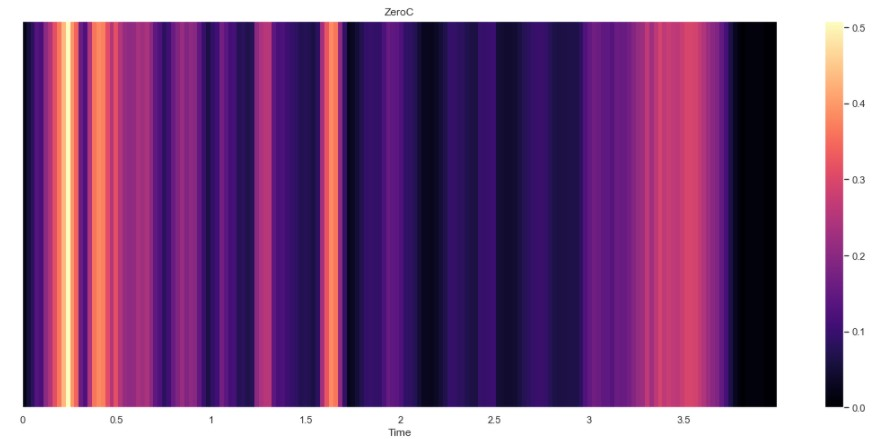

### Alpaslan Erdag
<table>
<tr>
<td>
  
### Project title: Analyzing Features Effects on Classifying Emotion Detection from Human Voice
</td>
</tr>
</table>

<table>
<tr>
<td>

## About

I am planning to do my dissertation on "Speech Analysis and Processing". In this study, I chose the subject of emotion detection from the human voice. In this way, I hope to have knowledge on important topics (such as data analysis, feature extraction, dimension reduction, classifiers) related to my thesis.
<p align="center"> 
  
</p>
  
The roadmap for the project up to classification is shown in the Fig.1 . In this coursework, __I aim to measure the effects of feature extraction methods(like MFCC,ZCR) and feature selections on accuracy performance.__ I'm considering using the kNN classifier and SVM classifier to make these measurements. I will evaluate the classification results using the accuracy metric(like accuracy, confusion matrix) and make a detailed analysis.

So far, I used The Ryerson Audio-Visual Database of Emotional Speech and Song (RAVDESS)[1] is used as the database.[1] It is a database comprising of  voice samples of 24 actors (12 male, 12 female). The speech of these are in various emotions and all the actors speak in North American English accent. The dataset also contains 7,356 high-quality video recordings which correspond to the audio dataset. The dataset voice samples for eight emotional expressions; neutral, calm, happy, sad, angry, fearful, surprise, and disgust. The data set for song samples for six emotional expressions viz., neutral, calm, happy, sad, angry, and fearful. All emotion expressions, except neutral, are expressed at two levels of emotional intensity normal and strong. In this study I only used speech data.
  
 There are lots of featues used in audio process. I extracted the MFCC,Choroma ,Stft, Zero-crossing rate among them and use these with diffirent combinations.
  
</td>
</tr>
</table>

## Used Libraries
### os : 
This module provides a portable way of using operating system dependent functionality. I've used this library with "listdir" attribute to read files in the folder. It return a list containing the names of the entries in the directory given by path. The list is in arbitrary order, and does not include the special entries '.' and '..' even if they are present in the directory. If a file is removed from or added to the directory during the call of this function, whether a name for that file be included is unspecified.
### librosa :  
librosa is a python package for music and audio analysis. It provides the building blocks necessary to create music information retrieval systems.For more details you can click [this link](https://librosa.org/doc/latest/index.html) and reach whole library. I have used this library for especially feature extraction and visualisation. Many of temporal and spectral features that can be obtained from human voice. then I will use data relating to our feature which is croma, zcr(zero-crossing rate), STFT and Mel Frequency Cepstral Coefficients (MFCCs) as inputs feature vector to classification algorithms. For classification I'm planning to use SVM,KNN and some neural network algorithm likes MLP. That's going be done witt the submission 3.
### pandas :
When working with tabular data, such as data stored in spreadsheets or databases, pandas is the right tool for you. pandas will help you to explore, clean, and process your data. pandas supports the integration with many file formats or data sources out of the box (csv, excel, sql, json, parquet,…). Importing data from each of these data sources is provided by function with the prefix read_*. Similarly, the to_* methods are used to store data. For more detail you can reach documentation of this library via 
[this link](https://pandas.pydata.org/docs/user_guide/index.html)

### numPy :

NumPy offers comprehensive mathematical functions, random number generators, linear algebra routines, Fourier transforms, and more. So almost in every Python program(especially related with math) you can see that numpy is used.


## For Data Visualisation
Bar chart of Class and Data Distribution
```python
height = [96, 192, 192, 192, 192,192,192,192]
bars = ('neutral', 'calm','happy','sad','angry','fear','disgust','surprise')
y_pos = np.arange(len(bars))

# Create bars
plt.bar(y_pos, height)

# Create names on the x-axis
plt.xticks(y_pos, bars)

# Show graphic
plt.show() 
```
<p align="center"> 
  
</p>

```python

# Some examples from emotions ---> fear 
fname = RAV + '\\Actor_14\\03-01-06-02-02-01-14.wav'  
data, rate = librosa.load(fname)
plt.figure(figsize=(15, 5))
librosa.display.waveplot(data, sr=rate,color='#00E7DB') # colour turquoise for fear 

# Lets play the audio 
ipd.Audio(fname)

```
<p align="center"> 
  
</p>

```python
# Some examples from emotions ---> anger
fname2 =RAV+ "\\Actor_08\\03-01-05-02-01-01-08.wav" 
data, rate = librosa.load(fname2)
plt.figure(figsize=(15, 5))
librosa.display.waveplot(data, sr=rate,color='#C00808')
# Lets play the audio 
ipd.Audio(fname2)

```

<p align="center"> 
  
</p>

```python
# feature extraction 
def extract_feature(path):
    
    X,_ = librosa.load(path)
    zeroC= librosa.feature.zero_crossing_rate(y=X)
    stft = librosa.amplitude_to_db(abs(librosa.stft(X)))
    mfcc = librosa.feature.mfcc(y=X, sr=rate, n_mfcc=13)
    chroma = librosa.feature.chroma_stft(y=X, sr=13)
    return stft,mfcc,chroma,zeroC

```
Visualtisation of Some of the Features
ZCR
<p align="center"> 
  
</p>
MFCC
<p align="center"> 
  
</p>
STFT
<p align="center"> 
  
</p>

## Feature Extraction

This is an example part of code about MFCC feature extraction function. By using similar functions, one by one 4 other feature extraction methods also defined. After that all the features extracted.

```python

def mfcc_feature_exract():
    mf = pd.DataFrame(columns=['MFCC feature'])

    counter=0
    for index,path in enumerate(full_path.path):
        
        X, rate = librosa.load(path, res_type='kaiser_fast',duration=2.5,sr=22050,offset=0.5)
        rate = np.array(rate)
        mfccs = np.mean(librosa.feature.mfcc(y=X, sr=rate, n_mfcc=20).T,axis=0)  # mean as the feature
        mf.loc[counter] = [mfccs]
        counter+=1
            
    print(len(mf))        
    return mf

```
## Results

After extracting feautures,again these inputs given to classifiers one by one to train them. 

# Classification results for 16-Class Situation

Features | MLP CLASSIFIER ACCURACY  | SVM ACCURACY |  KNN ACCURACY
------------ | ------------- | ------------ | -------------
MFCC | %72.57 | %53.47 | %74.82 
ZCR | %9.1 | %6.2 | %30.4 | 
MEL | %33.68 | %22.2  | %49.65  | 
CHROMA | %19.44 | 20.83  | %49.65  | 
STFT | %67.36 | %70.49 | %62.84  | 

# Classification results for 8-Class Situation

Features | MLP CLASSIFIER ACCURACY  | SVM ACCURACY |  KNN ACCURACY
------------ | ------------- | ------------ | -------------
MFCC | %65.62 | %46.18 | %75.43 
ZCR | %16.32 | %16.67 | %36.1 | 
MEL | %44.44 | %34.03  | %52.42  | 
CHROMA | %24.44 | 20.83  | %42.36  | 
STFT | %64.93 | %58.33 | %63.28  | 

## Progress Table and Comments

Steps | Progress (Update: 11.12.2021)
------------ | -------------
Short Literature Review and writing ReadmeFile :) | %100
Data preprocess, visualisation | %100
Feature Extraction | %100
Classification Performance | %100
Final Report | %100

